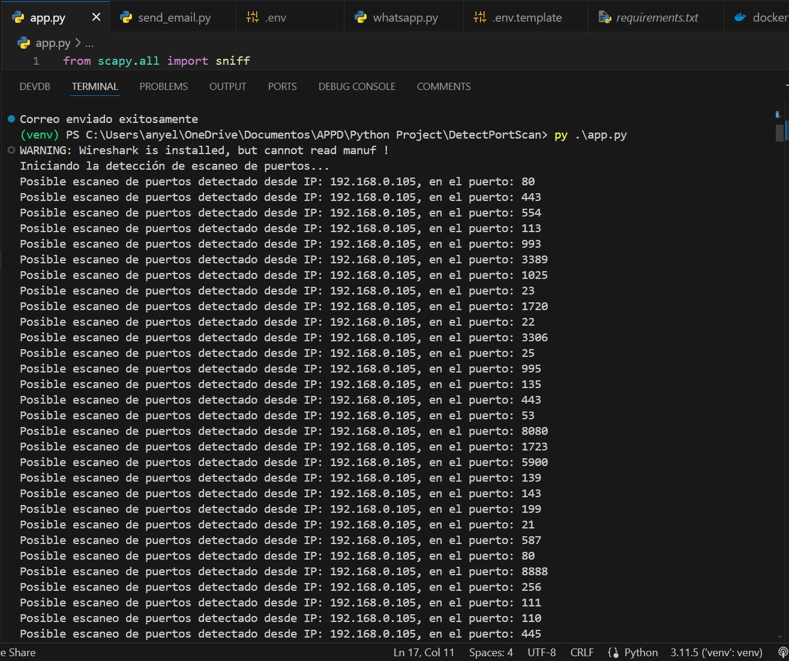

### **Select Language:** 🌍 
- [Español (Spanish)](README-es.md)
- [English](README.md)


# Port Scan Detection in Host

Este proyecto detecta intentos de escaneo de puertos en una máquina y bloquea la IP atacante. Además, envía alertas al usuario a través de correo electrónico y mensajes de WhatsApp.

## RESULTS
### Send Emails

### WhatsApp

### Detect Scan


## Características

- **Detección de escaneo de puertos:** Utiliza `scapy` para monitorear y detectar paquetes TCP sospechosos.
- **Bloqueo de IP:** Bloquea automáticamente la IP atacante utilizando `iptables` en Unix o el firewall de Windows.
- **Alertas:** Envía alertas de seguridad a través de correo electrónico y WhatsApp cuando se detecta un posible escaneo de puertos.
- **Escaneo de IP:** Utiliza `nmap` para obtener información detallada sobre el dispositivo atacante, incluyendo puertos abiertos, sistema operativo, y más.

## Instalación

1. **Clona el repositorio:**

   ```bash
   git clone https://github.com/Anyel-ec/PY-FLASK-Port-Scan-Detection-In-Host.git
   cd PY-FLASK-Port-Scan-Detection-In-Host
   ```

2. **Configura el entorno virtual (opcional pero recomendado):**

   ```bash
   python3 -m venv venv
   source venv/bin/activate  # En Windows usa `venv\Scripts\activate`
   ```

3. **Instala las dependencias:**

   ```bash
   pip install -r requirements.txt
   ```

4. **Configura las variables de entorno:**

   Crea un archivo `.env` en el directorio raíz del proyecto con el siguiente contenido:

   ```env
   SENDER=tu_email@gmail.com
   PASSWORD=tu_contraseña_de_email
   account_sid=tu_account_sid_de_twilio
   auth_token=tu_auth_token_de_twilio
   from_whatsapp_number=whatsapp:+1234567890
   to_whatsapp_number=whatsapp:+0987654321
   ```

## Uso

1. **Inicia la detección de escaneo de puertos:**

   ```bash
   python -m app
   ```

2. **Monitorea la salida de la consola para ver las alertas y las acciones tomadas.**

## Estructura del Proyecto

- `app/`
  - `__init__.py`
  - `port_scanner.py`: Módulo principal que inicia la detección de escaneo de puertos.
  - `detect_scan.py`: Función para detectar escaneos de puertos.
  - `block.py`: Función para bloquear la IP atacante.
  - `alert.py`: Función para enviar alertas por correo electrónico y WhatsApp.
  - `scan.py`: Función para obtener información del dispositivo atacante usando `nmap`.
  - `progress.py`: Función para actualizar el progreso del escaneo detectado.
  - `ip_utils.py`: Función para obtener la dirección IP de la máquina.

## Dependencias

- `scapy`
- `nmap`
- `smtplib`
- `twilio`
- `dotenv`

## Contribuciones

Las contribuciones son bienvenidas. Por favor, sigue los pasos a continuación:

1. Haz un fork del repositorio.
2. Crea una nueva rama (`git checkout -b feature/nueva-funcionalidad`).
3. Realiza tus cambios y haz commits (`git commit -am 'Añadir nueva funcionalidad'`).
4. Empuja la rama (`git push origin feature/nueva-funcionalidad`).
5. Crea un nuevo Pull Request.

## Licencia

Este proyecto está bajo la licencia MIT. Para más detalles, consulta el archivo `LICENSE`.
