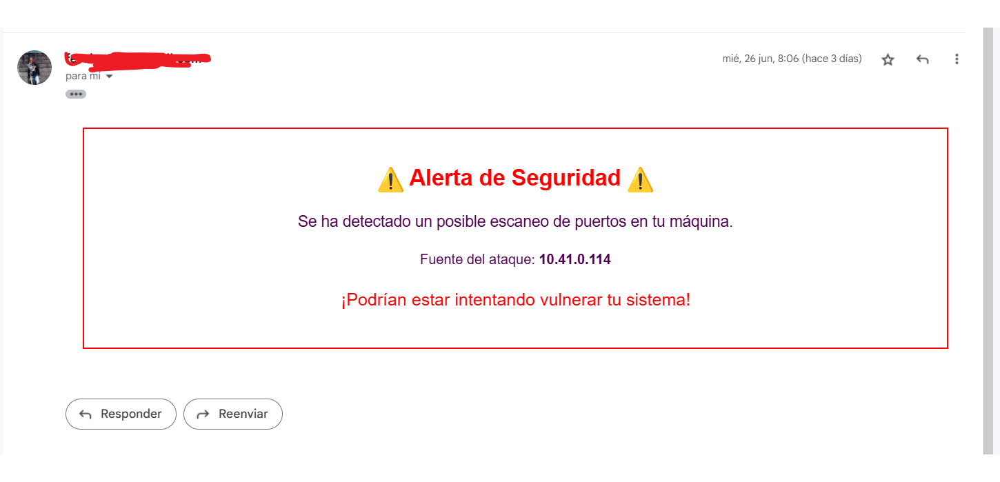

### **Select Language:** 🌍
- [Español (Spanish)](README-es.md)
- [English](README.md)

# Port Scan Detection in Host

This project detects port scan attempts on a machine and blocks the attacker's IP. Additionally, it sends alerts to the user via email and WhatsApp messages.

## RESULTS
### Send Emails

### WhatsApp

### Detect Scan


## Features

- **Port Scan Detection:** Uses `scapy` to monitor and detect suspicious TCP packets.
- **IP Blocking:** Automatically blocks the attacker's IP using `iptables` on Unix or Windows firewall.
- **Alerts:** Sends security alerts via email and WhatsApp when a possible port scan is detected.
- **IP Scanning:** Uses `nmap` to obtain detailed information about the attacking device, including open ports, operating system, and more.

## Installation

1. **Clone the repository:**

   ```bash
   git clone https://github.com/Anyel-ec/PY-FLASK-Port-Scan-Detection-In-Host.git
   cd PY-FLASK-Port-Scan-Detection-In-Host
   ```

2. **Set up a virtual environment (optional but recommended):**

   ```bash
   python3 -m venv venv
   source venv/bin/activate  # On Windows use `venv\Scripts\activate`
   ```

3. **Install dependencies:**

   ```bash
   pip install -r requirements.txt
   ```

4. **Configure environment variables:**

   Create a `.env` file in the project's root directory with the following content:

   ```env
   SENDER=your_email@gmail.com
   PASSWORD=your_email_password
   account_sid=your_twilio_account_sid
   auth_token=your_twilio_auth_token
   from_whatsapp_number=whatsapp:+1234567890
   to_whatsapp_number=whatsapp:+0987654321
   ```

## Usage

1. **Start port scan detection:**

   ```bash
   python -m app
   ```

2. **Monitor the console output to see alerts and actions taken.**

## Project Structure

- `app/`
  - `__init__.py`
  - `port_scanner.py`: Main module that starts port scan detection.
  - `detect_scan.py`: Function to detect port scans.
  - `block.py`: Function to block the attacker's IP.
  - `alert.py`: Function to send alerts via email and WhatsApp.
  - `scan.py`: Function to get information about the attacking device using `nmap`.
  - `progress.py`: Function to update the scan detection progress.
  - `ip_utils.py`: Function to get the machine's IP address.

## Dependencies

- `scapy`
- `nmap`
- `smtplib`
- `twilio`
- `dotenv`

## Contributions

Contributions are welcome. Please follow the steps below:

1. Fork the repository.
2. Create a new branch (`git checkout -b feature/new-feature`).
3. Make your changes and commit them (`git commit -am 'Add new feature'`).
4. Push the branch (`git push origin feature/new-feature`).
5. Create a new Pull Request.

## License

This project is licensed under the MIT License. For more details, see the `LICENSE` file.